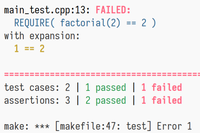
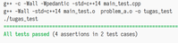

> **TODO: UBAH "NAMA" DAN "NPM" MENJADI NAMA DAN NPM KALIAN PADA KEMUDIAN HAPUS BARIS INI!**
# Tugas Praktikum Struktur Data 10

> Materi: Graph  
> Pengajar: Asisten Praktikum 2021
## NAMA - NPM

**Harap untuk membaca instruksi terlebih dahulu sampai dipahami!**

---


## Deskripsi Tugas

Implementasi graph menggunakan adjacency list dan Object Oriented Programming pada C++11.

Referensi:
* https://www.cplusplus.com/reference/stl/
* https://www.cplusplus.com/doc/tutorial/classes/
* https://www.cplusplus.com/doc/tutorial/templates/
* https://kodedasar.com/class-cpp/
* https://structilmy.com/2020/08/tutorial-struktur-data-map-pada-c/


## Tugas

* Isi nama dan NPM pada file `README.md`
* Baca dokumentasi pada file-file `graph.hpp` kemudian implementasikan pada file tersebut.
* Implementasikan kode sampai semua test berhasil/_passing_.
  * Contoh jika ada test yang gagal:  
    
  * Contoh semua test berhasil:  
    
* GitHub Action akan menampilkan cek hijau jika semua test berhasil dan silang merah jika ada test
  yang gagal.
* **Jika test berjalan di lokal tapi tidak pada GitHub, harap hubungi asisten praktikum!**


## Petunjuk

Praktikan hanya bisa mengubah file-file berikut:
* `main.cpp`
* `README.md`
* `graph.hpp`

> Isi `main.cpp` tidak akan diperhatikan oleh penilaian atau asisten. Jadi boleh digunakan sebagai
> tempat untuk testing atau debugging pribadi praktikan.

Penjelasan untuk file lainnya:
* `main_test.cpp` berisi spesifikasi test untuk tugas (**JANGAN DIUBAH!**)
* `catch.hpp` berisi library testing Catch2 (**JANGAN DIUBAH!**)
* `Makefile` digunakan untuk mengeksekusi perintah-perintah tugas (**JANGAN DIUBAH!**)
* Direktori `img/` berisi gambar-gambar untuk `README.md` (**JANGAN DIUBAH!**)

File hasil kompilasi ada dua _executable_ dan beberapa file `.o`:
* `tugas` (atau `tugas.exe` pada Windows) berasal dari `main.cpp`.
* `tugas_test` (atau `tugas_test.exe` pada Windows) berasal dari `main_test.cpp` yang akan
  dijalankan oleh GitHub autograder untuk penilaian. Akan tetapi bisa dijalankan juga oleh praktikan
  untuk testing secara lokal.
* File-file `.o` adalah _object code_ atau _object file_ yang dihasilkan oleh proses kompilasi,
  **jadi tidak perlu diperhatikan**, hiraukan saja. Secara kasar,
  > _Source Code_: code for humans  
  > _Object Code_: code for machines

## Perintah yang Dapat Digunakan

* Kompilasi terhadap `main.cpp` dan `main_test.cpp`:
  ```shell
  make
  ```
* Kompilasi terhadap `main.cpp` saja:
  ```shell
  make tugas
  ```
  Untuk Windows:
  ```shell
  make tugas.exe
  ```
* Kompilasi terhadap `main_test.cpp` saja:
  ```shell
  make tugas_test
  ```
  Untuk Windows:
  ```shell
  make tugas_test.exe
  ```
* **Untuk menjalankan semua test yang diberikan pada tugas**:
  ```shell
  make test
  ```
  Perintah diatas akan menjalankan `tugas_test`. Jika file `tugas_test` belum ada, maka akan secara
  otomatis dilakukan kompilasi terlebih dahulu.
  > Perintah ini akan dijalankan oleh GitHub autograder untuk penilaian.
* Untuk menjalankan `main.cpp`:
  ```shell
  make run
  ```
  Perintah diatas akan menjalankan `tugas`. Jika file `tugas` belum ada, maka akan secara otomatis dilakukan kompilasi terlebih dahulu.
* **Untuk menghapus file-file hasil kompilasi**:
  ```shell
  make clean
  ```


## Catatan

* Kode hanya akan dievaluasi jika dapat dikompilasi! Karena jika tidak berhasil dalam proses
  kompilasi maka tidak akan ada file _executable_ untuk melakukan test.
* Pencatatan nilai akan dilakukan oleh asisten pada commit terakhir saat deadline.
* Tugas juga akan dievaluasi secara manual oleh asisten.
* Penilaian juga akan dilakukan terhadap kualitas kode.
* Deadline dapat dicek pada GitHub Classroom. Jika tidak dapat ditemukan, hubungi asisten.
* Aturan dan instruksi lain yang disampaikan pada pertemuan praktikum juga berlaku.
* **Jika ada kendala, segera hubungi asisten!**


## Lisensi
MIT License 2021
